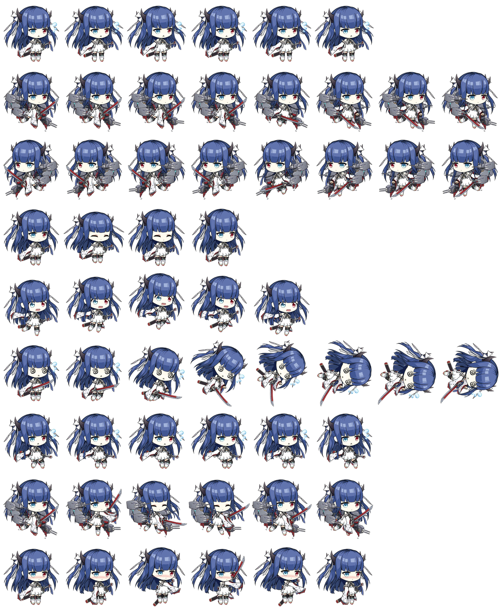

<div align="center">

<!-- Language Toggle -->
<h4>
  <a href="#中文">🇨🇳 中文</a>
  &nbsp;|&nbsp;
  <a href="#english">🇬🇧 English</a>
</h4>



<br>

</div>

---

<!-- ==================== 中文版 ==================== -->

<a name="中文"></a>

## 🌸 伊吹 — Codex 桌面宠物

> *「伊吹山的艾草，常被用来比喻安静燃烧的恋心，就好比现在……指挥官能感觉到吗？伊吹的……心。」*

**伊吹**（峦）是碧蓝航线重樱阵营的最高方案重巡洋舰，一位诞生于图纸与未竟之梦中的刀使巫女。她拥有异色双瞳，喜爱剑道与和歌，手执「灵峰之刃」，在日复一日的刻苦修行中不断寻觅自身存在的意义。

本项目将伊吹制作为 [Codex](https://github.com/openai/codex) 的桌面宠物，让她在你编程时默默陪伴在终端旁。

### ✨ 特性

- 🎨 精美的 Q 版精灵图动画
- 🖥️ 适配 Codex CLI 桌面宠物系统
- ⚡ 轻量级，仅需两个文件即可运行

### 📦 安装方法

#### macOS

1. 创建 Codex 宠物目录：

```bash
mkdir -p ~/.codex/pets/ibuki
```

2. 克隆本仓库：

```bash
git clone https://github.com/NagatoBigSeven/ibuki-codex-pet.git
```

3. 进入项目根目录
```bash
cd ibuki-codex-pet/
```

4. 将 `pet.json` 和 `spritesheet.webp` 复制到 Codex 宠物目录下：
```bash
cp pet.json spritesheet.webp ~/.codex/pets/ibuki/
```

5. 启动 Codex，伊吹就会出现在你的终端中！🎉

### 📁 文件结构

```
~/.codex/pets/ibuki/
├── pet.json            # 宠物配置文件（ID、名称、描述）
└── spritesheet.webp    # 精灵图集（动画帧）
```

### 📄 pet.json 配置说明

| 字段 | 说明 |
|------|------|
| `id` | 宠物的唯一标识符 |
| `displayName` | 显示名称 |
| `description` | 宠物的背景故事描述 |
| `spritesheetPath` | 精灵图文件的相对路径 |

### 📜 许可证

本项目采用 [MIT License](LICENSE) 开源。

Copyright © 2026 Zongmin Zhang (张 宗民)

---

<!-- ==================== English ==================== -->

<a name="english"></a>

## 🌸 Ibuki — Codex Desktop Pet

> *"The mugwort on Mount Ibuki is said to symbolize love that burns quietly... F-For example, right now, Milord... can you feel Ibuki's heart?"*

**Ibuki** is the highest-priority Priority Research Heavy Cruiser of the Sakura Empire in Azur Lane — a shrine maiden swordswoman born from blueprints and unfulfilled dreams. With her heterochromatic eyes, love for kendo and waka poetry, and the blade "Reihō no Yaiba" in hand, she endlessly seeks the meaning of her own existence through daily devoted training.

This project brings Ibuki to life as a desktop pet for [Codex](https://github.com/openai/codex), letting her quietly accompany you by your terminal while you code.

### ✨ Features

- 🎨 Beautifully crafted chibi sprite animations
- 🖥️ Native integration with the Codex CLI desktop pet system
- ⚡ Lightweight — only two files needed

### 📦 Installation

#### macOS

1. Create the Codex pets directory:

```bash
mkdir -p ~/.codex/pets/ibuki
```

2. Clone this repository:

```bash
git clone https://github.com/NagatoBigSeven/ibuki-codex-pet.git
```

3. Enter the project root directory:
```bash
cd ibuki-codex-pet/
```

4. Copy `pet.json` and `spritesheet.webp` to the Codex pets directory:
```bash
cp pet.json spritesheet.webp ~/.codex/pets/ibuki/
```

5. Launch Codex, and Ibuki will appear in your terminal! 🎉

### 📁 File Structure

```
~/.codex/pets/ibuki/
├── pet.json            # Pet configuration (ID, name, description)
└── spritesheet.webp    # Spritesheet (animation frames)
```

### 📄 pet.json Configuration

| Field | Description |
|-------|-------------|
| `id` | Unique identifier for the pet |
| `displayName` | Display name shown in Codex |
| `description` | Lore / backstory description of the pet |
| `spritesheetPath` | Relative path to the spritesheet file |

### 📜 License

This project is open-sourced under the [MIT License](LICENSE).

Copyright © 2026 Zongmin Zhang (张 宗民)

---

<div align="center">
  <sub>Made with 💙 for Ibuki</sub>
</div>
